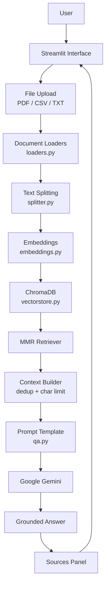

# Document Q&A — Multi-Document RAG

A Retrieval-Augmented Generation (RAG) application for asking questions across multiple PDF, CSV, and TXT documents, built with LangChain, ChromaDB, local sentence-transformer embeddings, and Google Gemini.


---

## Overview

Document Q&A is a Streamlit application that lets a user upload one or more PDF, CSV, or TXT files and ask natural-language questions about their contents. Uploaded documents are parsed, split into chunks, embedded locally with a sentence-transformer model, and stored in a Chroma vector database. When a question is asked, relevant chunks are retrieved using Maximal Marginal Relevance (MMR) search and passed as context to Google Gemini, which generates an answer grounded in the retrieved content. Each answer is accompanied by its source chunks, including file name, PDF page number, or CSV row, depending on the file type.

The system supports **multiple documents at once**: all uploaded files are chunked, embedded, and stored together in a single vector collection, so a single question can be answered using information from any of the uploaded files.

---

## Key Features

- Upload and process multiple PDF, CSV, and TXT files in a single session
- Automatic document loading and type-specific parsing
- Text chunking tuned separately for row-based (CSV) and text-based (PDF/TXT) content
- Local embedding generation using a sentence-transformer model (no embedding API calls)
- Persistent vector storage with ChromaDB, isolated per uploaded file set
- MMR-based retrieval for relevant and non-redundant context
- Context-grounded answer generation via Google Gemini
- Automatic query routing between targeted lookup questions and whole-document overview questions
- Source transparency: file name, page number (PDF), row number (CSV), and retrieved chunk text
- Chat-style interface with persisted conversation history in the UI
- Duplicate-chunk removal and context length capping before generation

---

## Architecture



Each stage corresponds directly to a module in the codebase, described in [File Responsibilities](#file-responsibilities).

---

## How the RAG Pipeline Works

### 1. Document ingestion

`loaders.py` selects a loader based on file extension:

| Extension | Loader |
|---|---|
| `.pdf` | `PyPDFLoader` |
| `.csv` | `CSVLoader` |
| `.txt` | `TextLoader` (UTF-8) |

Any other extension raises a `ValueError`. Uploaded files are written to a temporary file, loaded, and the temporary file is deleted immediately afterward. The original uploaded filename is preserved by overwriting each resulting document's `source` metadata field.

### 2. Document splitting

`splitter.py` applies different logic depending on file type:

- **CSV files** are *not* re-split. `CSVLoader` already produces one `Document` per row, and the splitter detects a `.csv` source and returns the documents unchanged.
- **PDF and TXT files** are split using `RecursiveCharacterTextSplitter` with:
  - `chunk_size = 500`
  - `chunk_overlap = 50`

### 3. Embeddings

`embeddings.py` uses a local HuggingFace sentence-transformer model:

```python
HuggingFaceEmbeddings(model_name="sentence-transformers/all-MiniLM-L6-v2")
```

Embeddings are generated entirely on the local machine — no external embedding API call is made. Only the final answer generation step uses a hosted API (Gemini).

### 4. Vector database

`vectorstore.py` stores chunks and their embeddings in Chroma:

```python
Chroma.from_documents(
    documents=documents,
    embedding=embeddings,
    persist_directory="chroma_db",
    collection_name=collection_name
)
```

Each unique set of uploaded files gets its own collection, named `multi_document_<hash>`, where `<hash>` is the first 12 characters of an MD5 hash of the sorted, concatenated filenames. This means the same set of files reuses/creates a stable collection, and a different set of files creates a distinct one.

### 5. Retrieval

Retrieval uses **Maximal Marginal Relevance (MMR)**, not plain cosine-similarity top-k search:

```python
vectorstore.as_retriever(
    search_type="mmr",
    search_kwargs={"k": 5, "fetch_k": 15, "lambda_mult": 0.7}
)
```

MMR first fetches 15 candidate chunks by similarity, then selects 5 that balance relevance to the query against diversity among the selected chunks — reducing the chance of returning several near-duplicate chunks from the same section of a document.

### 6. Context construction

Retrieved chunks are deduplicated (based on content, source, page, and row) and then capped:

- Targeted questions: up to **5** chunks, up to **12,000** characters of context.
- Overview questions (see below): up to **20,000** characters, drawn from the entire stored collection rather than a top-k retrieval.

If a chunk would exceed the remaining character budget, it is truncated rather than dropped entirely.

### 7. Generation

Gemini is called through `langchain_google_genai.ChatGoogleGenerativeAI`, configured as:

```python
ChatGoogleGenerativeAI(model="gemini-3.5-flash-lite", temperature=0)
```

`temperature=0` favors deterministic, focused answers over creative variation, which is appropriate for grounded Q&A.

### 8. Grounding (query routing)

Before retrieval, the application checks whether the question matches a hardcoded list of overview-style phrases (e.g. *"what is this document about"*, *"give me a summary"*, *"describe this file"*) using simple substring matching on the lowercased question. This is a lightweight heuristic, not a machine-learned classifier.

- **Overview questions** are answered from *all* stored chunks across *all* uploaded documents, using a dedicated summarization prompt.
- **All other questions** are answered using the top chunks returned by the MMR retriever, using a dedicated lookup prompt.

Both prompts instruct Gemini to answer strictly from the supplied context and to reply with an exact fallback string, `"I don't know based on the provided document."`, when the answer cannot be found. This is a **hallucination-reduction** strategy via context-grounded generation — it does not guarantee the complete absence of hallucinations, since the underlying LLM ultimately produces the final text.

> **Note:** The chat interface displays prior questions and answers, but conversation history is not currently fed back into retrieval or generation — each question is answered independently based only on the retrieved document context.

---

## Multi-Document Retrieval

- Multiple uploaded files are all processed in a single pass: each is loaded, tagged with its original filename, and split according to its type.
- All resulting chunks from every uploaded file are combined into one list and embedded together into a **single Chroma collection** for that file set.
- Because retrieval and the overview aggregation both operate over this shared collection, a question can be answered using chunks originating from any of the uploaded files — not just one.
- The application only reprocesses documents when the set of uploaded filenames changes, avoiding redundant embedding work for the same files across reruns.

---

## Source Transparency

Every answer includes the chunks used to generate it. Each source entry displays:

| Field | Applies to | Notes |
|---|---|---|
| File name | All types | Shown via `os.path.basename` of the stored `source` metadata |
| Page number | PDF | Stored 0-indexed internally, displayed as `page + 1` |
| Row number | CSV | Taken from the `row` metadata added by `CSVLoader` |
| Retrieved content | All types | The raw chunk text, shown in an expandable, read-only text area |

Sources are shown in a "View Sources" expander under each answer, both in the live response and in the persisted chat history.

---

## Hallucination / Grounding Strategy

The application reduces hallucination risk through **context-grounded generation** rather than any guarantee of factual accuracy:

- Both the lookup prompt and the overview prompt explicitly instruct Gemini to use only the supplied document context and to avoid outside knowledge.
- The prompts direct the model to respond with a fixed "I don't know" message when the answer isn't present in the retrieved context.
- Retrieved context is deduplicated and length-capped before being sent to the model, keeping the prompt focused on relevant material.

This is best described as *hallucination reduction*, not elimination — the final answer is still produced by a generative model and should be verified against the displayed sources for anything high-stakes.

---

## Tech Stack

| Technology | Purpose |
|---|---|
| Python | Application logic |
| Streamlit | Web interface and chat UI |
| LangChain (`langchain-core`, `langchain-community`, `langchain-text-splitters`) | Document loading, splitting, and prompt orchestration |
| `langchain-chroma` | Chroma integration for vector storage/retrieval |
| `langchain-huggingface` | Local embedding generation |
| `langchain-google-genai` | Gemini chat model integration |
| ChromaDB | Persistent vector database |
| sentence-transformers (`all-MiniLM-L6-v2`) | Embedding model |
| Google Gemini (`gemini-3.5-flash-lite`) | Answer generation |
| `python-dotenv` | Loading environment variables from `.env` |
| PyPDFLoader / CSVLoader / TextLoader | File-type-specific document parsing |

---

## Project Structure

```text
Document-Q&A/
│
├── app.py              # Streamlit UI, upload handling, chat interface
├── qa.py                # RAG query routing, prompting, and Gemini generation
├── vectorstore.py        # Chroma creation, retriever, full-collection access
├── loaders.py            # File-type-specific document loading
├── splitter.py           # Chunking logic for CSV vs PDF/TXT
├── embeddings.py          # Local embedding model configuration
├── requirements.txt
├── .gitignore
└── README.md
```

`chroma_db/` is created automatically at runtime by Chroma's `persist_directory` setting and is not part of the source tree — it should be excluded from version control.

---

## File Responsibilities

### `app.py`
Streamlit page configuration, sidebar file uploader, document-processing pipeline trigger (only on file-set change), collection-name hashing, session-state management (uploaded files, chunk counts, chat messages), chat rendering, and source display.

### `loaders.py`
Selects and runs the appropriate LangChain document loader (`PyPDFLoader`, `CSVLoader`, `TextLoader`) based on file extension, and raises an error for unsupported types.

### `splitter.py`
Chooses chunking strategy based on file type — skips re-splitting for CSV (already row-based), and applies `RecursiveCharacterTextSplitter(chunk_size=500, chunk_overlap=50)` for PDF and TXT content.

### `embeddings.py`
Configures the local `HuggingFaceEmbeddings` model (`all-MiniLM-L6-v2`) used for all vector representations.

### `vectorstore.py`
Creates and persists the Chroma collection, configures the MMR retriever (`k=5`, `fetch_k=15`, `lambda_mult=0.7`), and exposes a helper to pull every stored chunk for overview-style questions.

### `qa.py`
Builds both prompt templates (lookup and overview), classifies incoming questions via keyword matching, retrieves and deduplicates context, enforces context length limits, invokes Gemini, extracts plain text from the response, and assembles the source list returned to the UI.

---

## Installation

```bash
git clone <repository-url>
cd Document-Q&A
python -m venv venv
```

Activate the virtual environment on Windows:

```bash
venv\Scripts\activate
```

Install dependencies:

```bash
pip install -r requirements.txt
```

---

## Environment Variables

The application requires a Google Gemini API key, loaded via `python-dotenv`. Create a `.env` file in the project root:

```env
GOOGLE_API_KEY=your_api_key_here
```

Do not commit `.env` to version control — add it to `.gitignore`.

---

## Running the Application

```bash
streamlit run app.py
```

Streamlit will start a local development server and open the application in your browser. On launch, you'll see the upload sidebar and an empty state describing supported file types until documents are uploaded.

---

## Usage

1. Launch the application.
2. Upload one or more PDF, CSV, or TXT files from the sidebar.
3. Wait for the "Processing documents..." step to complete.
4. Ask a question in the chat input.
5. Review the generated answer.
6. Expand "View Sources" to inspect the exact retrieved chunks behind the answer.

---

## Example Questions

```text
What is this document about?
Summarize these documents.
Who works in the AI Engineering department?
What is Umer Tariq's position?
What is Sara Ahmed's salary?
Which employee has the highest salary?
```

The first two trigger the overview path (whole-collection summarization); the remaining examples are answered via targeted MMR retrieval and are best suited to structured data such as an uploaded employee CSV.

---

## Example Workflow

1. A user uploads `employees.csv` and `handbook.pdf`.
2. Each file is loaded, tagged with its filename, and chunked according to its type (CSV rows kept intact, PDF text split into 500-character chunks).
3. All chunks are embedded locally and stored in one Chroma collection unique to this file pair.
4. The user asks: *"What is Sara Ahmed's salary?"*
5. The question doesn't match an overview phrase, so it's routed to MMR retrieval — the most relevant CSV rows are retrieved.
6. The retrieved rows are deduplicated, capped at 5, and inserted into the lookup prompt as context.
7. Gemini generates an answer using only that context.
8. The answer is shown along with a "View Sources" panel listing the matching CSV row(s).

---

## 📸 Screenshots

> Screenshots coming soon.

---

## Technical Concepts Learned

- Retrieval-Augmented Generation (RAG) pipeline design
- Embedding generation and vector representations of text
- Vector database storage and retrieval with ChromaDB
- Maximal Marginal Relevance (MMR) as a diversity-aware retrieval strategy
- Type-aware document loading and chunking strategies
- Prompt engineering for context-grounded generation
- Lightweight heuristic query routing (lookup vs. summarization)
- LLM API integration (Google Gemini) via LangChain
- Building interactive, stateful applications with Streamlit
- Session-state management and avoiding redundant reprocessing
- Source attribution and transparency in RAG systems

---

## Future Improvements

- Hybrid search (combining keyword and semantic retrieval)
- Reranking of retrieved chunks
- OCR support for scanned PDFs
- Improved table extraction from PDFs
- Persistent conversation memory (using chat history in retrieval/generation, not just display)
- Authentication and multi-user support
- Formal RAG evaluation and retrieval quality metrics
- Streaming token-by-token responses
- Cloud deployment
- Document management (viewing/removing individual documents from a collection)
- Duplicate document detection across uploads

---

## Learning Outcomes

This project demonstrates practical, end-to-end AI engineering skills: designing a RAG pipeline from document ingestion through grounded generation, working with embeddings and vector databases, implementing retrieval strategies beyond naive similarity search, engineering prompts for faithfulness and refusal behavior, integrating a hosted LLM API, and building a usable interface around the whole system with Streamlit.

---

## Author

**Abdullah**
GitHub: [Abdullah12-svg](https://github.com/Abdullah12-svg)

